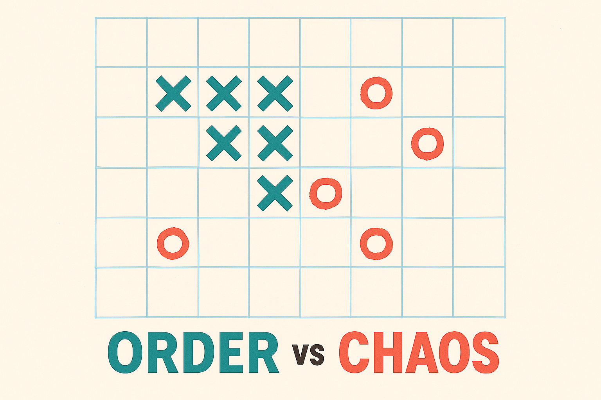
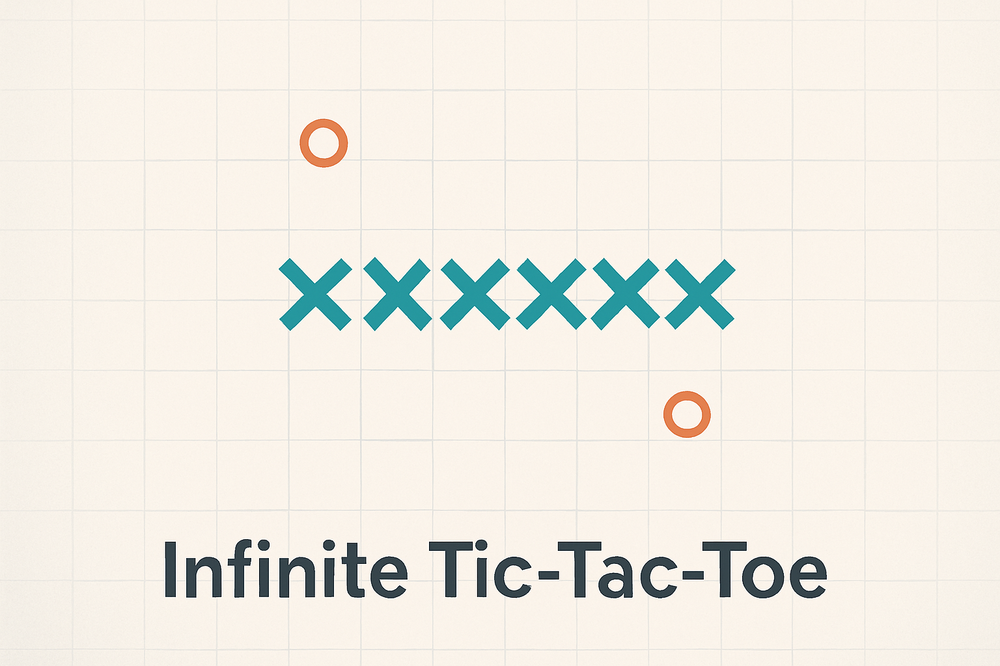
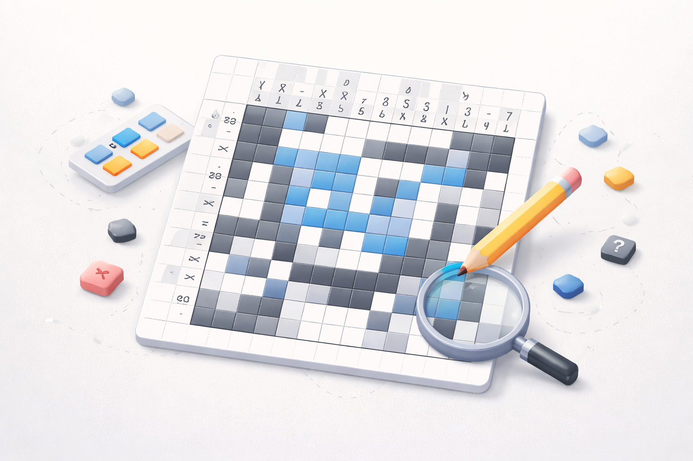
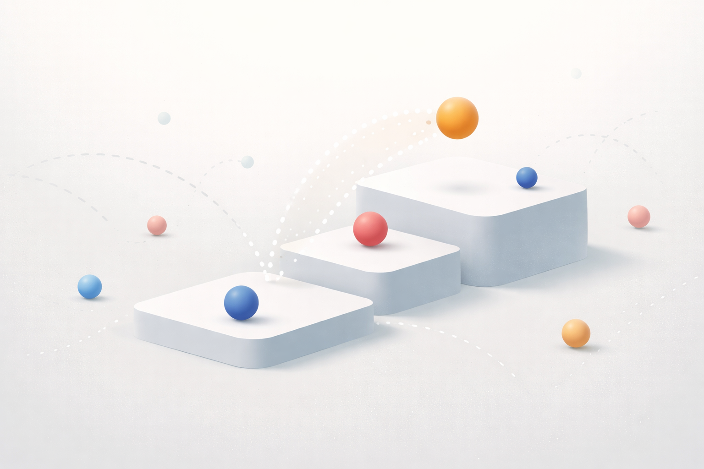

# Paper Games Collection

A collection of strategic board games, brain-teasing puzzles, and mesmerizing simulations.

**Play now:** [https://prabhakar267.github.io/paper-games/](https://prabhakar267.github.io/paper-games/)

---

## Games

| Game | Description |
|------|-------------|
|  | **[Order vs Chaos](https://prabhakar267.github.io/paper-games/order-chaos/)** A strategic duel where one player seeks order and the other thrives on chaos |
|  | **[Infinite Tic-Tac-Toe](https://prabhakar267.github.io/paper-games/infinite-tic-tac-toe/)** Classic tic-tac-toe evolved - battle on an endless grid with challenging AI |
|  | **[Pic-a-Pix](https://prabhakar267.github.io/paper-games/pic-a-pix/)** Nonogram puzzles that challenge your logic - decode number clues to reveal hidden images |
|  | **[Bouncing Balls](https://prabhakar267.github.io/paper-games/bouncing-balls/)** Mesmerizing physics simulation where colorful balls compete through gravity and collisions |

---

## Tech Stack

- Pure HTML5, CSS3, and JavaScript
- Responsive design for mobile and desktop
- No external dependencies

## Development

Each game is self-contained in its own directory with shared resources in `common/`:
- `common/styles.css` - Common styling
- `common/utils.js` - Shared utilities
- `common/assets/` - Shared assets
